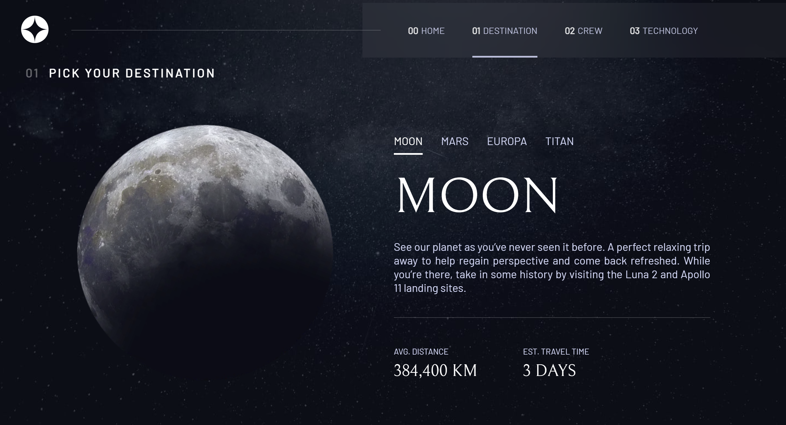

# Frontend Mentor - Space tourism website solution

This is a solution to the [Space tourism website challenge on Frontend Mentor](https://www.frontendmentor.io/challenges/space-tourism-multipage-website-gRWj1URZ3). Frontend Mentor challenges help you improve your coding skills by building realistic projects. 

## Table of contents

- [Overview](#overview)
  - [The challenge](#the-challenge)
  - [Screenshot](#screenshot)
  - [Links](#links)
- [My process](#my-process)
  - [Built with](#built-with)
  - [What I learned](#what-i-learned)
  - [Continued development](#continued-development)
- [Author](#author)

## Overview

### The challenge

Users should be able to:

- View the optimal layout for each of the website's pages depending on their device's screen size
- See hover states for all interactive elements on the page
- View each page and be able to toggle between the tabs to see new information

### Screenshot

### Links

- Solution URL: [Frontedn Mentor](https://your-solution-url.com)
- Live Site URL: 

## My process

### Built with

- Semantic HTML5 markup
- CSS custom properties
- Flexbox
- Mobile-first workflow
- [React](https://reactjs.org/)

### What I learned

This project was an excellent opportunity to practice state mangement for tabs and best design practice overall. I put particular attention to smooth out the transitions between the pages and the tabs.

### Continued development

I would complete this project differently if I were to start from scratch. 

1: I would use CSS grid for both mobile and desktop versions of the website. I tend to use Flexbox for mobile since elements are aligned in a column. However, this created problems down the line because of section division and naming. I resolved that by adding div around certain elements and adjusting the styling, but the end result might have been better had I used CSS only.

2: I want to improve the fading between tabs and pages while still using useState. I used state management to switch between pages and tabs, but this in turn created an issue with adding a smooth fade between the elements because I could not use CSS transform animations since the elements were removed from the state before they could apply. I used Framer Motion, but the animation is still a bit rough compared to how it could be achieved with CSS.

3: A better method to keep track of the pages on rerendering. The navbar underline created some issues when reloading the page. To keep track of the changes I moved the state management to the top level, but it continued to create problem when reloading one of the pages because the state would go back to "home." I used localStorage and React's useLocation as a solution, but I would like to find a better solution for my next project.

## Author

- Website - [Kangkm](https://vm.tiktok.com/ZM6Ec1YUk/)
- Frontend Mentor - [@KangFennex](https://www.frontendmentor.io/profile/KangFennex)
